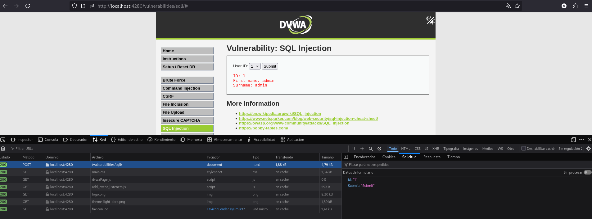
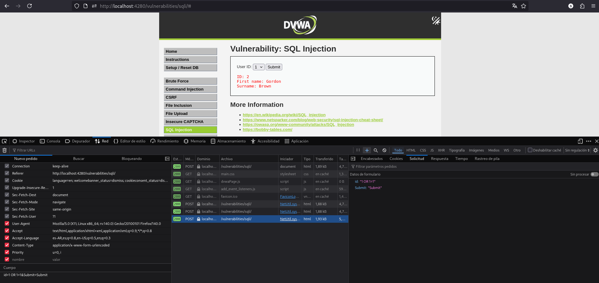
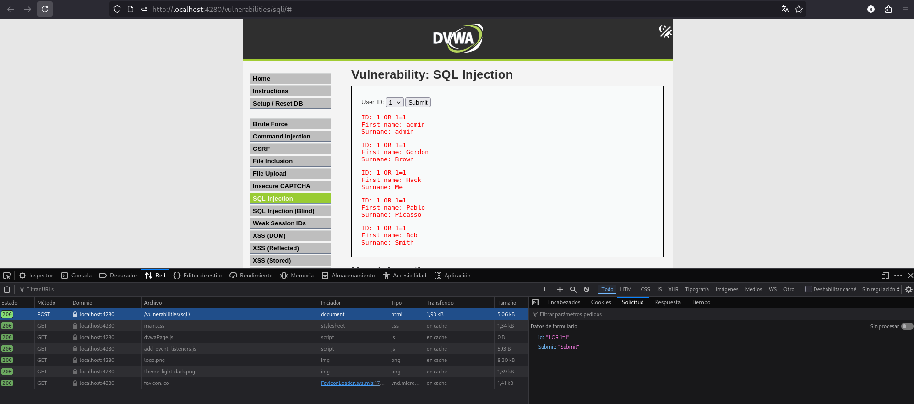
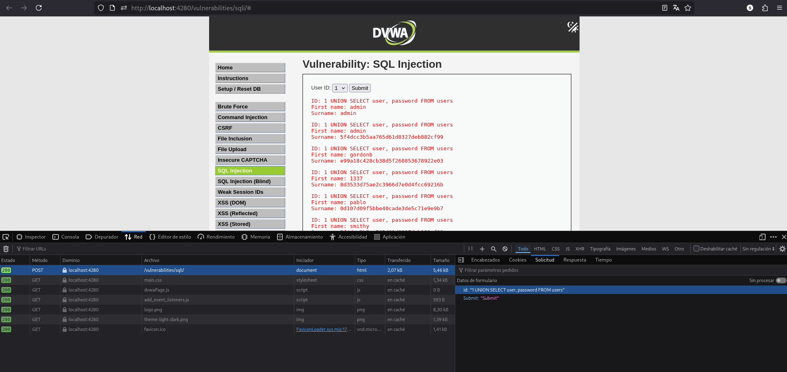
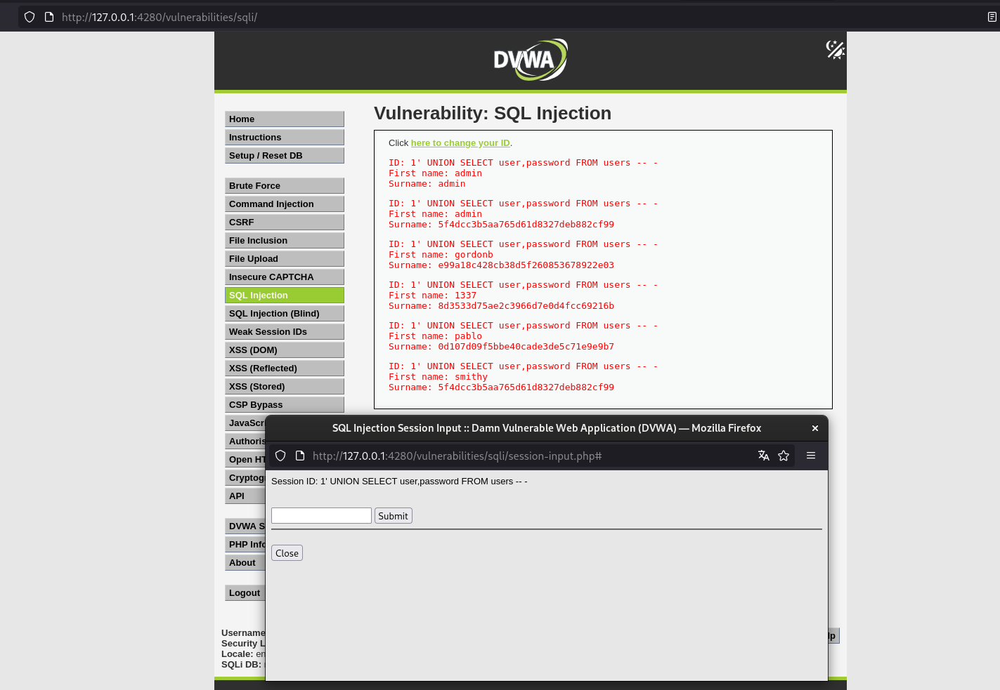
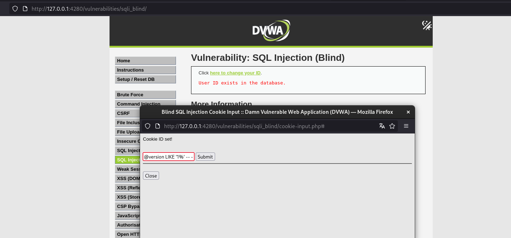
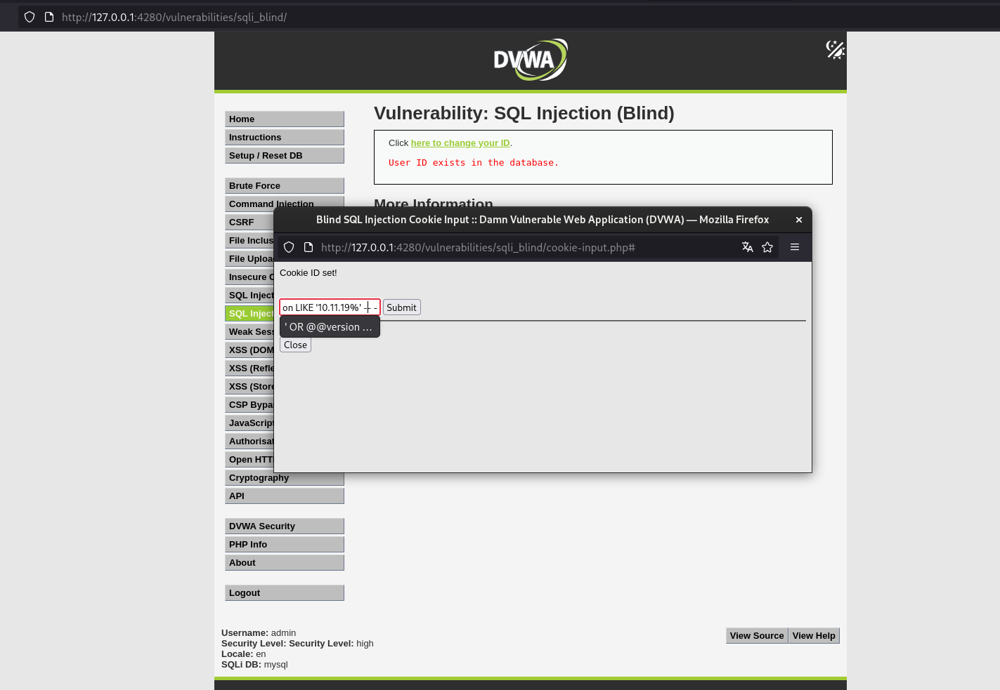

# Vulnerabilidades de DVWA

## 📑 Tabla de Contenidos
- [SQL Injection - Low](#sql-injection---low)
- [SQL Injection - Medium](#sql-injection---medium)
- [SQL Injection - UNION-based - Medium](#sql-injection---union-based---medium)
- [SQL Injection - UNION-based - High](#sql-injection---union-based---high)
- [SQL Injection (Blind) - High](#sql-injection-blind---high)

## SQL Injection - Low

**Categoría OWASP:** A05:2025 - Injection

**Descripción:** Manipular la consulta SQL del módulo de SQL Injection para obtener información de múltiples usuarios.

**Análisis**

Primero probé el funcionamiento normal introduciendo:

```
1
```

La aplicación devolvió los datos correspondientes al usuario con id = 1.


La consulta utilizada por la aplicación es:

```sql
SELECT first_name, last_name FROM users WHERE user_id = '$id';
```

El problema, al igual que se vio en las inyecciones de Juice Shop, es que el valor proporcionado por el usuario se concatena directamente dentro de la consulta SQL.

**Payload / exploit**

Utilicé el siguiente payload:

```
1' OR '1'='1' #
```

El payload cierra la comilla del parámetro id, agrega una condición siempre verdadera y utiliza # para comentar el resto de la consulta, entonces el WHERE es verdadero en todas las filas y la aplicación devuelve todos los usuarios.


## SQL Injection - Medium

**Categoría OWASP:** A05:2025 - Injection

**Descripción:** Explotar la protección implementada en el nivel Medium para obtener información de múltiples usuarios.

**Análisis**

A diferencia de Low, el formulario utiliza un menú desplegable y envía el parámetro mediante `POST`. Además, el código aplica `mysqli_real_escape_string()` sobre el valor recibido.

La petición manda el `id` junto con un string `Submit` que podemos modificar.



Sin embargo, la consulta se construye de la siguiente manera:

```sql
SELECT first_name, last_name FROM users WHERE user_id = $id;
```

A diferencia de Low, el parámetro id no está entre comillas. Por lo tanto, aunque se aplique mysqli_real_escape_string(), todavía es posible introducir una expresión SQL válida.

**Payload / exploit**

Modifiqué la petición POST para enviar:

```
1 OR 1=1
```


La consulta resultante queda:

```sql
SELECT first_name, last_name
FROM users
WHERE user_id = 1 OR 1=1;
```

Como 1=1 siempre es verdadero, la aplicación devolvió los datos de los cinco usuarios.

**Resultado**

Fue posible modificar la condición WHERE y obtener los datos de todos los usuarios.



**Mitigación**

La vulnerabilidad se puede evitar utilizando consultas parametrizadas / prepared statements, de manera que la entrada del usuario sea tratada como un dato y no pueda modificar la estructura de la consulta SQL.

Referencia: OWASP A05:2025 – Injection

## SQL Injection - UNION-based - Medium

Descripción: Utilizar una inyección basada en UNION para obtener información adicional de la tabla users.

**Análisis**

Una vez comprobada la inyección anterior, utilicé UNION SELECT para consultar otras columnas de la tabla users.

Como la consulta original devuelve dos columnas (first_name y last_name), el UNION también debía devolver dos columnas.

**Payload / exploit**

Utilicé:

```sql
1 UNION SELECT user, password FROM users
```

La consulta resultante queda conceptualmente como:

```sql
SELECT first_name, last_name
FROM users
WHERE user_id = 1
UNION
SELECT user, password FROM users;
```

De esta forma, la primera columna del resultado muestra el nombre de usuario y la segunda la contraseña almacenada.



**Resultado**

Fue posible utilizar la vulnerabilidad para obtener los nombres de usuario y las contraseñas almacenadas de los cinco usuarios de la base de datos.

**Mitigación**

La mitigación es la misma indicada en el apartado anterior: utilizar consultas parametrizadas / prepared statements para evitar que la entrada del usuario pueda modificar la estructura de la consulta SQL.

Referencia: OWASP A05:2025 – Injection

## SQL Injection - UNION-based - High

**Categoría OWASP:** A05:2025 - Injection

**Descripción:** Explotar la SQL Injection del nivel High para obtener las contraseñas de los cinco usuarios de la base de datos.

**Objetivo**

El apartado **Help** indica que existen cinco usuarios en la base de datos, con IDs del 1 al 5, y que el objetivo es obtener sus contraseñas mediante SQL Injection.

**Análisis**

En este nivel, el valor ingresado se transfiere mediante una variable de sesión antes de llegar a la consulta vulnerable. `session-input.php` almacena el valor proporcionado en `$_SESSION['id']`, que posteriormente es utilizado por `high.php`.

La consulta contiene además `LIMIT 1`:

```sql
SELECT first_name, last_name
FROM users
WHERE user_id = '$id'
LIMIT 1;
```

Como el valor de `id` continúa llegando directamente a la consulta, fue posible utilizar `-- -` para comentar la parte restante de la sentencia y eliminar el `LIMIT 1`.

Una vez comprobado el funcionamiento, utilicé el siguiente payload para cumplir el objetivo del ejercicio:

```text
1' UNION SELECT user,password FROM users -- -
```

La consulta resultante queda conceptualmente como:

```sql
SELECT first_name, last_name
FROM users
WHERE user_id = '1'
UNION
SELECT user,password FROM users
-- - LIMIT 1;
```

El `UNION SELECT` utiliza las columnas `user` y `password` de la tabla `users`, por lo que los resultados mostrados como `First name` y `Surname` corresponden en realidad al nombre de usuario y al valor almacenado en `password`.



**Resultado**

Fue posible obtener mediante SQL Injection los cinco nombres de usuario y los valores almacenados en la columna `password`, cumpliendo el objetivo indicado por DVWA.

Este nivel muestra que utilizar una variable de sesión como intermediaria no impide la SQL Injection cuando el valor controlado por el usuario termina siendo concatenado directamente en una consulta vulnerable.

**Mitigación**

La mitigación es la misma indicada en los niveles anteriores: utilizar consultas parametrizadas / prepared statements para evitar que la entrada del usuario pueda modificar la estructura de la consulta SQL.

Referencia: OWASP A05:2025 – Injection

## SQL Injection (Blind) - High

**Categoría OWASP:** A05:2025 - Injection

**Descripción:** Utilizar una Blind SQL Injection para identificar la versión del software de base de datos mediante respuestas de tipo verdadero/falso.

**Objetivo**

El apartado **Help** indica que el objetivo es encontrar la versión del software de base de datos mediante un ataque de Blind SQL Injection.

**Análisis**

A diferencia de los niveles anteriores, la aplicación no devuelve directamente los resultados de la consulta. En su lugar, utiliza el valor almacenado en la cookie `id` para ejecutar la consulta y únicamente informa si existe algún resultado.

La consulta utilizada es:

```sql
SELECT first_name, last_name
FROM users
WHERE user_id = '$id'
LIMIT 1;
```

El resultado de la consulta se almacena en la variable `$exists`. Si se encuentra al menos una fila, la aplicación muestra:

```text
User ID exists in the database.
```

En caso contrario, devuelve un error `404` y muestra:

```text
User ID is MISSING from the database.
```

Esto permite realizar preguntas de verdadero o falso mediante SQL y utilizar la respuesta de la aplicación para inferir información que no se muestra directamente.

**Payload / exploit**

Primero comprobé el comportamiento utilizando condiciones conocidas como verdaderas y falsas para confirmar que la respuesta de la aplicación podía utilizarse como indicador.

Luego utilicé `@@version`, que permite consultar la versión del software de base de datos, y realicé diferentes preguntas mediante `LIKE`.

Por ejemplo:

```text
' OR @@version LIKE '1%' -- -
```

La respuesta fue `User ID exists`, indicando que la versión comienza con `1`.



Continué concatenando valores:

```
10 -> exist
10. -> exist
10.1 -> exist
10.11 -> exist
10.11. -> exist
10.11.1 -> exist
```

y finalmente:

```text
' OR @@version LIKE '10.11.19%' -- -
```

obteniendo nuevamente una respuesta verdadera.

De esta manera pude reconstruir mediante preguntas de verdadero/falso el comienzo de la versión:

```text
10.11.19-
```

La versión identificada fue **MariaDB 10.11.19**.



**Resultado**

Fue posible identificar mediante Blind SQL Injection que el software de base de datos utilizado por la aplicación es **MariaDB 10.11.19**, sin que la aplicación mostrara directamente el valor de `@@version`.

El ejercicio demuestra cómo una aplicación que únicamente proporciona respuestas de verdadero/falso puede ser utilizada para inferir información mediante una serie de consultas SQL.

**Mitigación**

La mitigación es la misma indicada en los niveles anteriores: utilizar consultas parametrizadas / prepared statements para evitar que la entrada del usuario pueda modificar la estructura de la consulta SQL.

Referencia: OWASP A05:2025 – Injection
