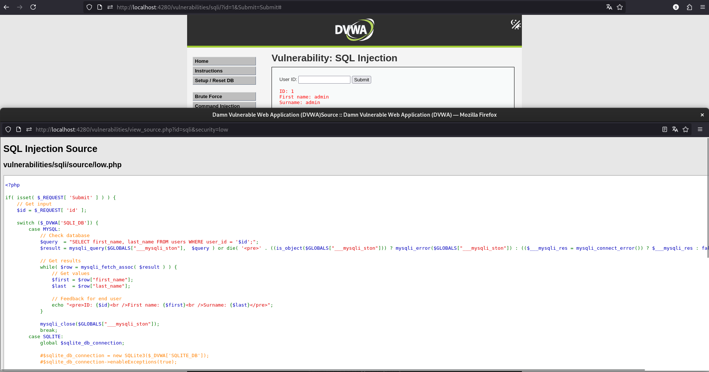
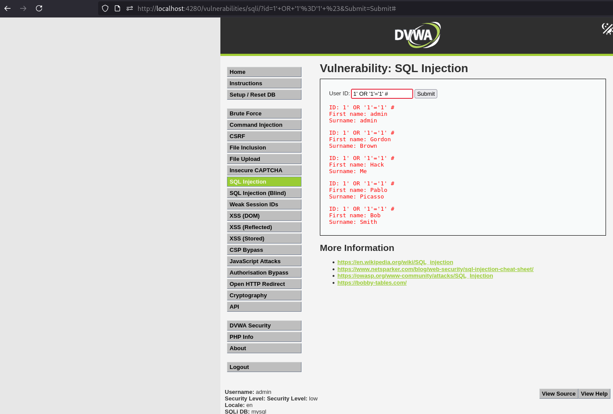
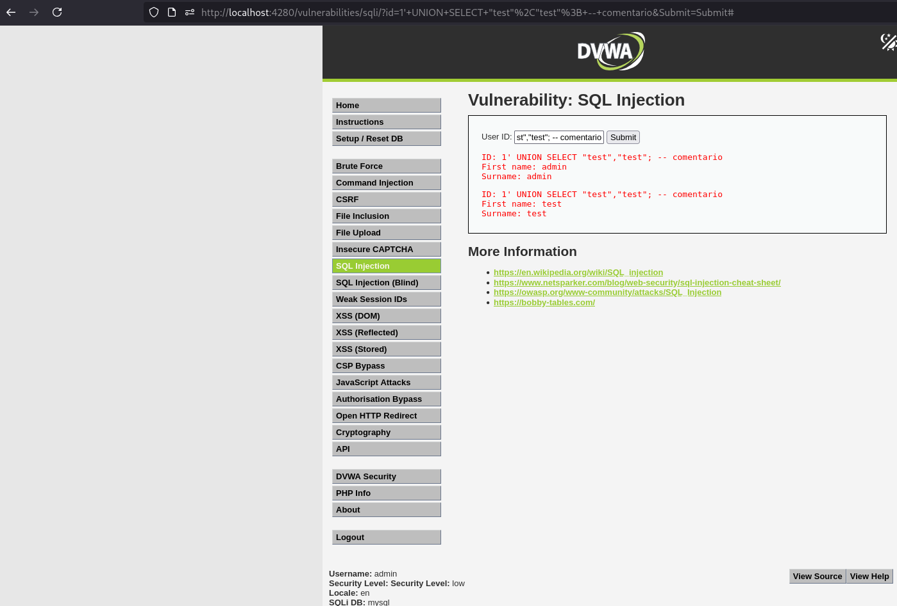

# Vulnerabilidades de DVWA
## SQL Injection — Low

**Categoría OWASP:** A05:2025 - Injection

**Descripción:** Manipular la consulta SQL del módulo de SQL Injection para obtener información de múltiples usuarios.

**Análisis**

Primero probé el funcionamiento normal introduciendo:

```
1
```

La aplicación devolvió los datos correspondientes al usuario con id = 1.



La consulta utilizada por la aplicación es:

```sql
SELECT first_name, last_name FROM users WHERE user_id = '$id';
```

El problema, al igual que se vio en las inyecciones de Juice Shop, es que el valor proporcionado por el usuario se concatena directamente dentro de la consulta SQL.

**Payload / exploit**

Utilicé el siguiente payload:

```
1' OR '1'='1' #
```

El payload cierra la comilla del parámetro id, agrega una condición siempre verdadera y utiliza # para comentar el resto de la consulta, entonces el WHERE es verdadero en todas las filas y la aplicación devuelve todos los usuarios.



**Resultado**

Fue posible modificar la consulta SQL y obtener los datos de todos los usuarios de la tabla.

**Mitigación**

La vulnerabilidad se puede evitar utilizando consultas parametrizadas / prepared statements, de manera que la entrada del usuario sea tratada como un dato y no pueda modificar la estructura de la consulta SQL.

Referencia: [OWASP A05:2025 – Injection](https://owasp.org/Top10/2025/A05_2025-Injection/)

## SQL Injection — UNION-based

**Descripción:** Utilizar una inyección basada en `UNION` para agregar resultados propios a los obtenidos por la consulta original.

**Análisis**

Después de comprobar la SQL Injection básica, revisé el apartado **Help** de DVWA, donde se indica que el nivel Low permite escapar de la consulta y ejecutar una consulta SQL adicional mediante `UNION SELECT`.

La consulta original devuelve dos columnas:

```
SELECT first_name, last_name FROM users WHERE user_id = '$id';
```

Por lo tanto, la consulta inyectada también debía devolver dos columnas.

**Payload / exploit**

Probé:
```text
1' UNION SELECT "test","test"; -- comentario
```

La consulta resultante queda conceptualmente como:

```sql
SELECT first_name, last_name
FROM users
WHERE user_id = '1'
UNION
SELECT "test","test";
```

La primera comilla cierra el valor original de id, UNION SELECT agrega una segunda consulta con dos columnas y -- comenta el resto de la consulta original.



**Resultado**

La aplicación devolvió tanto el resultado de la consulta original como el registro generado mediante UNION SELECT, mostrando test como nombre y apellido.

Esto confirmó que era posible utilizar la vulnerabilidad para incorporar resultados arbitrarios a la respuesta de la consulta original.

La mitigación es la misma indicada en el apartado anterior: utilizar consultas parametrizadas / prepared statements para evitar que la entrada del usuario pueda modificar la estructura de la consulta SQL.

Referencia: OWASP [A05:2025 – Injection](https://owasp.org/Top10/2025/A05_2025-Injection/)


