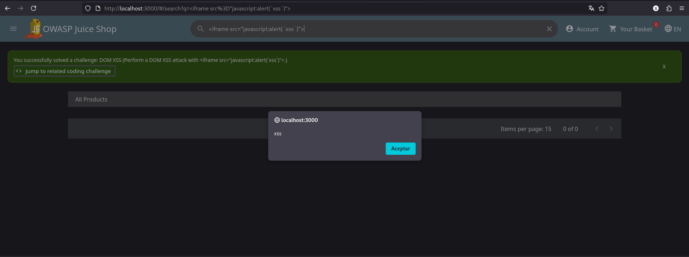
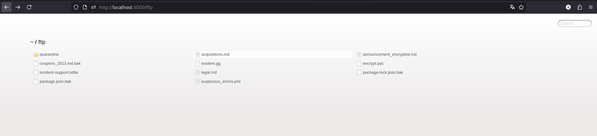

# OWASP Juice Shop - Challenges
## Challenge: Score Board
**Categoría OWASP:** A05:2021 – Security Misconfiguration

**Descripción:** Encontrar la página oculta `Score Board`, donde se muestra el progreso de los challenges completados.

**Payload/exploit:**
No se utilizó un payload. La ruta fue descubierta analizando el archivo JavaScript principal de la aplicación mediante las herramientas de desarrollo del navegador: `/#/score-board`

**Resultado:** Al acceder a la ruta, se mostró la página `Score Board` con el listado de challenges y su estado.

**Análisis:**
La aplicación incluye en el código JavaScript del lado del cliente una referencia a una ruta que no está expuesta directamente mediante la interfaz. Al ser una aplicación web cliente, el archivo `main.js` contiene información sobre las rutas disponibles, incluida `/#/score-board`.

El challenge demuestra que ocultar una funcionalidad simplemente eliminando su enlace de la interfaz no impide que pueda ser descubierta. Las rutas presentes en el código enviado al navegador pueden ser analizadas y accedidas directamente.

**Mitigación:**
No se debe confiar en que una funcionalidad está protegida por no aparecer en la interfaz o por utilizar una URL difícil de descubrir. Si una página o funcionalidad requiere restricciones de acceso, estas deben aplicarse mediante controles de autenticación y autorización.

## Challenge: DOM XSS
**Categoría OWASP:** A03:2021 – Injection

**Descripción:** Realizar un ataque DOM-Based Cross-Site Scripting utilizando el payload indicado por el challenge.

**Payload/exploit:** ``<iframe src="javascript:alert(`xss`)">``

El payload fue introducido en el campo de búsqueda de la aplicación.

**Resultado:**
Al procesarse la búsqueda, apareció una alerta con el texto `xss`, demostrando que fue posible ejecutar JavaScript controlado por el usuario en el navegador.


**Análisis:**
Una vulnerabilidad DOM XSS ocurre cuando datos controlados por el usuario son procesados por JavaScript en el navegador y posteriormente utilizados de forma insegura para modificar el DOM.

Para entender este tipo de vulnerabilidad se pueden identificar:
- **Source:** lugar desde el que se obtiene el dato controlado por el usuario.
- **Sink:** operación o función que utiliza ese dato y puede interpretarlo como HTML o código.

Por ejemplo:
```javascript
const input = location.hash; // Source
document.write(input);       // Sink peligroso
```
Si un atacante controla el contenido de `location.hash`, puede introducir código HTML malicioso. `document.write()` lo interpreta e inserta en la página.

En Juice Shop, el input se introduce mediante el campo de búsqueda. El problema se produce porque el valor ingresado termina siendo procesado mediante:
```
bypassSecurityTrustHtml(queryParam)
```
Esta función omite la sanitización de Angular para ese contenido y permite que el input sea tratado como HTML.

El payload crea un elemento `iframe` cuyo atributo `src` utiliza el esquema `javascript:`. Cuando el navegador procesa: ``javascript:alert(`xss`)`` ejecuta el código JavaScript y muestra la alerta.

**Mitigación:**
La solución específica consiste en eliminar el bypass de sanitización. El campo de búsqueda no necesita interpretar HTML, por lo que la entrada del usuario debería tratarse únicamente como texto.

De forma general, los datos no confiables no deberían insertarse en sinks peligrosos como `innerHTML` o `document.write()`. Cuando solo es necesario mostrar texto, se deben utilizar mecanismos seguros como: `element.textContent = userInput;`

**Referencia:** [ OWASP DOM Based XSS Prevention Cheat Sheet](https://cheatsheetseries.owasp.org/cheatsheets/DOM_based_XSS_Prevention_Cheat_Sheet.html?utm_source=chatgpt.com)
## Challenge: Bonus Payload
**Categoría OWASP:** A03:2021 – Injection

**Descripción:** Utilizar un payload alternativo en la misma vulnerabilidad DOM XSS del challenge anterior.

**Payload/exploit:**
```html
<iframe width="100%" height="166" scrolling="no" frameborder="no" allow="autoplay" src="https://w.soundcloud.com/player/?url=https%3A//api.soundcloud.com/tracks/771984076&color=%23ff5500&auto_play=true&hide_related=false&show_comments=true&show_user=true&show_reposts=false&show_teaser=true"></iframe>
```
El payload fue introducido en el mismo campo de búsqueda utilizado para explotar la vulnerabilidad DOM XSS.

**Resultado:**
La aplicación interpretó el payload como HTML y creó un `iframe` que cargó un reproductor de SoundCloud dentro de la página.


**Análisis:**
Este challenge utiliza la misma vulnerabilidad DOM XSS explicada anteriormente. La diferencia está en el payload utilizado.

En lugar de ejecutar una alerta, el payload aprovecha la posibilidad de inyectar HTML en el DOM para modificar el contenido visible de la página mediante un elemento `iframe`.

Esto demuestra que el impacto de una vulnerabilidad XSS no se limita a ejecutar `alert()`, sino que puede permitir modificar el contenido de la aplicación o cargar recursos externos.

**Mitigación:**
La mitigación es la misma que en el challenge anterior: eliminar el bypass de sanitización y evitar que los datos controlados por el usuario sean interpretados como HTML cuando la funcionalidad solo requiere mostrar texto.

**Referencia:** [OWASP DOM Based XSS Prevention Cheat Sheet](https://cheatsheetseries.owasp.org/cheatsheets/DOM_based_XSS_Prevention_Cheat_Sheet.html?utm_source=chatgpt.com)
## Challenge: Confidential Documents
**Categoría OWASP:** A05:2021 – Security Misconfiguration

**Descripción:** Acceder a un documento confidencial expuesto por la aplicación.

**Payload/exploit:**
No se utilizó un payload. En la página `About Us` se encontró un enlace hacia: /ftp/legal.md

Al eliminar `legal.md` de la URL, se accedió directamente al directorio: /ftp/

El servidor mostró un listado de documentos disponibles, entre ellos: `acquisitions.md`

Finalmente, se accedió al documento: /ftp/acquisitions.md

**Resultado:**
Fue posible acceder al documento confidencial `acquisitions.md`, completando el challenge.



**Análisis:**
La aplicación exponía públicamente el directorio `/ftp/`. El enlace a `legal.md` permitió descubrir la existencia de este directorio y, al acceder directamente a él, el servidor permitió listar los archivos almacenados.

Esto permitió enumerar documentos que no estaban destinados a ser accesibles públicamente y acceder directamente a uno de ellos.

El problema no consiste únicamente en que el archivo confidencial pueda descargarse, sino también en que fue almacenado dentro de una ubicación públicamente accesible y posteriormente olvidado allí.

**Mitigación:**
Los archivos confidenciales no deberían almacenarse dentro de directorios expuestos directamente por el servidor web. Es necesario clasificar los datos según su sensibilidad y almacenar cada tipo de información en una ubicación adecuada.

Cuando un documento sensible debe estar disponible para determinados usuarios, su acceso debería realizarse mediante mecanismos de autenticación y autorización.

También se deben revisar periódicamente los archivos y directorios expuestos públicamente para detectar información olvidada, accidentalmente publicada o que ya no debería estar disponible.

En este caso, la solución específica sería eliminar el directorio `/ftp/` público y trasladar su contenido legítimo a ubicaciones adecuadas. Los documentos confidenciales no deberían poder accederse directamente mediante una URL pública.

**Referencia:** [OWASP A05:2021 – Security Misconfiguration](https://cheatsheetseries.owasp.org/cheatsheets/File_System_and_Resource_Access_Cheat_Sheet.html?utm_source=chatgpt.com)
## Challenge: Exposed Metrics
**Categoría OWASP:** A09:2021 – Security Logging and Monitoring Failures

**Descripción:** Encontrar el endpoint que expone datos de uso para ser recolectados por un sistema de monitoreo popular.

**Payload/exploit:**
El enunciado mencionaba explícitamente a Prometheus. Al investigar el funcionamiento habitual de esta herramienta, se identificó que comúnmente utiliza el endpoint: `/metrics`

Se accedió directamente a: `http://localhost:3000/metrics`

**Resultado:**
El endpoint devolvió las métricas de la aplicación, completando el challenge.


**Análisis técnico:**
El challenge expone públicamente un endpoint de observabilidad utilizado para proporcionar métricas de la aplicación.

La mención de Prometheus en el enunciado permitió identificar una convención conocida de esta herramienta y probar directamente la ruta `/metrics`.

El problema es que cualquier usuario con acceso a la aplicación puede consultar información de monitoreo que normalmente debería estar disponible únicamente para sistemas o usuarios autorizados.

**Mitigación:**
Los endpoints de observabilidad no deberían estar accesibles públicamente cuando exponen información interna de la aplicación.

El acceso debería restringirse mediante controles como autenticación, autorización o limitaciones de red, permitiendo únicamente que los sistemas de monitoreo autorizados consulten las métricas.

También se debe revisar qué información se expone mediante estos endpoints y evitar incluir datos sensibles o detalles internos que puedan facilitar el reconocimiento de la aplicación.

**Referencia:** [OWASP A09:2021 – Security Logging and Monitoring Failures](https://cheatsheetseries.owasp.org/cheatsheets/Logging_Cheat_Sheet.html?utm_source=chatgpt.com)
