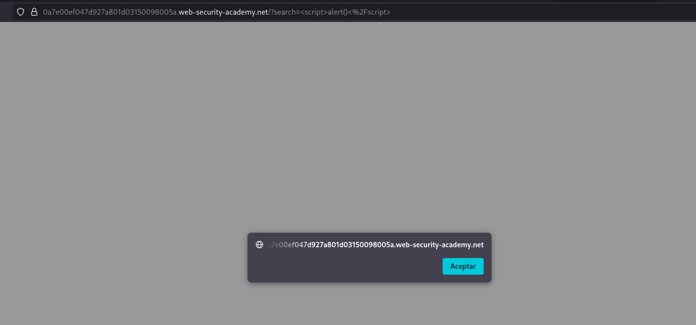
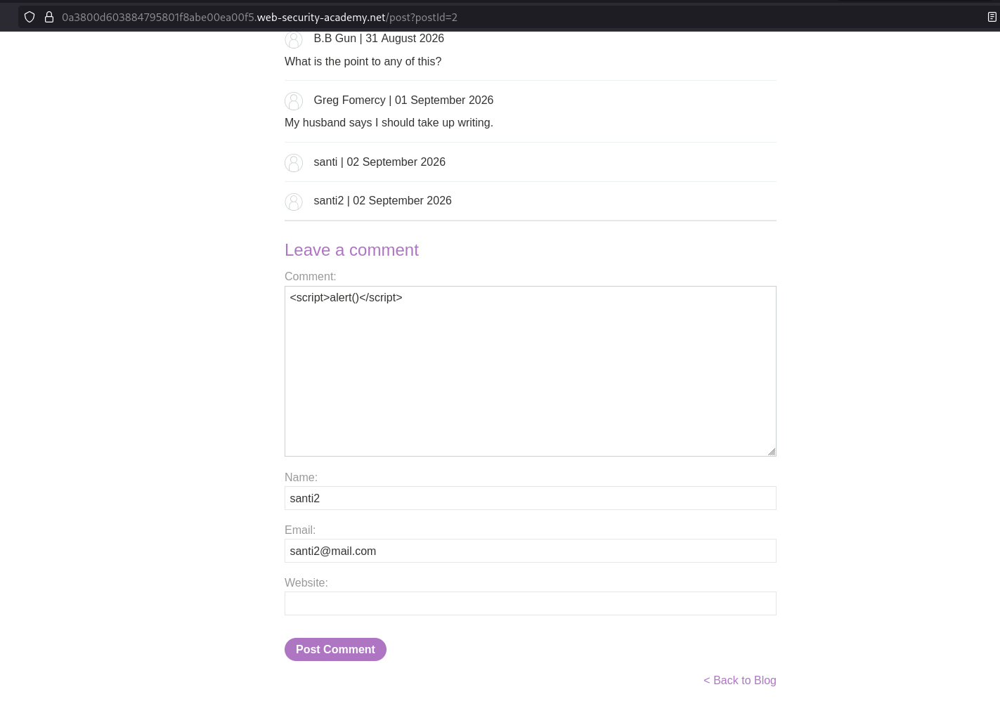
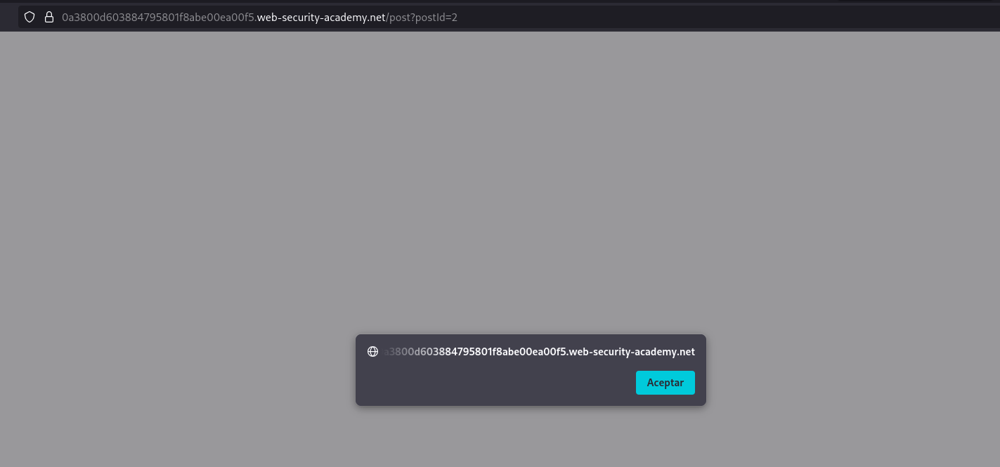

# Labs PortSwigger

## Reflected XSS

### Reflected XSS into HTML context with nothing encoded

**Descripción:** Realizar un ataque XSS reflejado que permita ejecutar la función `alert()`.

**Análisis**

La página tiene un buscador que refleja directamente el contenido de la búsqueda dentro del HTML de la respuesta, sin realizar ningún tipo de codificación.

Al no tratar el contenido ingresado como texto, es posible insertar etiquetas HTML que contengan código JavaScript.

**Payload / exploit**

Escribí dentro del buscador:

```text
<script>alert()</script>
```

La respuesta de la aplicación quedó conceptualmente:

```html
<p><script>alert()</script></p>
```

Al interpretar el HTML, el navegador reconoce la etiqueta `<script>` y ejecuta el código JavaScript contenido en ella.



**Resultado**

Fue posible ejecutar código JavaScript mediante una entrada reflejada en la respuesta de la aplicación, confirmando la existencia de una vulnerabilidad de Reflected XSS.

**Mitigación**

La principal mitigación es realizar **output encoding** de los datos antes de insertarlos en la respuesta, de manera que el contenido proporcionado por el usuario sea interpretado como texto y no como código HTML o JavaScript.

En este caso, caracteres especiales como `<` y `>` deberían codificarse antes de incluir el valor de búsqueda en el HTML.

También es recomendable utilizar una **Content Security Policy (CSP)** como capa adicional de defensa, aunque no sustituye al output encoding adecuado.

Referencia: [PortSwigger Web Security Academy – Reflected XSS](https://portswigger.net/web-security/cross-site-scripting/reflected)

## Lab: Stored XSS into HTML context with nothing encoded

**Descripción:** Subir un comentario que ejecute la función `alert()` cuando se visualiza el posteo.

**Análisis**

A diferencia del laboratorio anterior, el contenido ingresado no se refleja únicamente en la respuesta de la petición, sino que queda almacenado y se vuelve a mostrar cada vez que se visualiza el posteo.

Al no realizarse ningún tipo de codificación sobre el contenido almacenado, es posible insertar código que será interpretado por el navegador al cargar la página.

**Payload / exploit**

Comenté el post **"# Do You Speak English?"** utilizando:

```text
<script>alert()</script>
```



En el primer intento tuve un error de tipeo y escribí `Alert()` en lugar de `alert()`. Después de corregirlo, el payload se ejecutó correctamente al visualizar el comentario.

**Resultado**

Fue posible almacenar código JavaScript dentro de un comentario y ejecutarlo automáticamente cada vez que se visualiza el posteo.

Esto demuestra la diferencia principal con el **Reflected XSS** anterior: el payload permanece almacenado en la aplicación y no necesita ser enviado nuevamente en cada petición para ejecutarse.



**Mitigación**

La mitigación principal es realizar **output encoding** del contenido almacenado antes de insertarlo en el HTML, de manera que sea interpretado como texto y no como código HTML o JavaScript.

También puede utilizarse una **Content Security Policy (CSP)** como capa adicional de defensa, aunque no reemplaza el correcto tratamiento del contenido antes de mostrarlo.

Referencia: [PortSwigger Web Security Academy – Stored XSS](https://portswigger.net/web-security/cross-site-scripting/stored)
